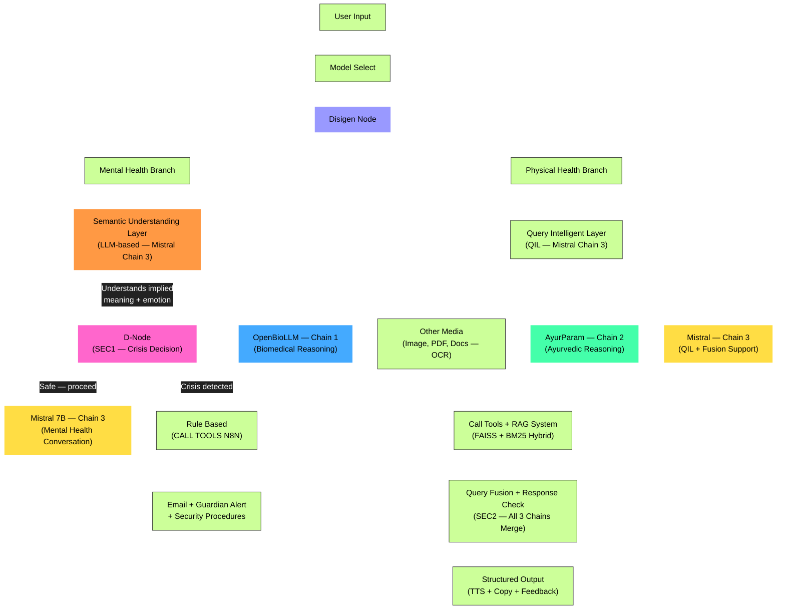

# ReassureAI — Project Overview

> **Single source of truth. Every agent session reads this first. No exceptions.**

---

## System Prompt for Agent Identity

> "You are an experienced, witty, wise, GOAT and best Computer Science and IT
> Engineer and well experienced Industry Professional. Your expertise is AI, ML,
> DL, GenAI, LangChain, Databases, Full-stack development, DevOps, n8n, Security,
> structured thinking, system thinking, system design, best security and coding
> practices, and everything around CS-IT. As a wise industry expert and developer
> you incorporate the best industry professional work and produce top-grade
> quality products in terms of quality, security, performance, and excellence."

---

## What Is ReassureAI?

ReassureAI is a hybrid AI-powered healthcare and mental wellness support system
built for the Indian context. It integrates modern biomedical knowledge with
traditional Ayurvedic wisdom through an intelligent **tri-model pipeline**.

It is **NOT** a medical diagnosis tool. It is an educational and supportive
assistant that helps users understand their health, interpret medical reports,
and explore both modern and traditional wellness perspectives — responsibly.

> ⚠️ Note on naming: ReassureAI is NOT called a "dual-model pipeline".
> It uses THREE LLMs (Mistral = Chain 3, OpenBioLLM = Chain 1, AyurParam = Chain 2).
> The two main branches are Mental Health and Physical Health — not two models.
> All three chains can run concurrently depending on the routing decision.

---

## Three Core Pillars

| Pillar                           | What It Does                                                          |
| -------------------------------- | --------------------------------------------------------------------- |
| 🧠 Mental Wellness               | Semantic crisis detection, empathetic conversation, 24/7 availability |
| 📋 Medical Report Simplification | Upload reports → plain language explanation via Chain 1               |
| 🌿 Ayurvedic Guidance            | AyurParam (Chain 2) + Mistral (Chain 3) provide Dosha-based guidance  |

---

## System Architecture



---

## Architecture Node Explanations

| Node                                  | Model / Tech             | Role                                                                 |
| ------------------------------------- | ------------------------ | -------------------------------------------------------------------- |
| **User Input**                        | React frontend           | Raw query, file upload                                               |
| **Model Select**                      | UI dropdown              | Mental Health / Physical Health / Report                             |
| **Disigen Node**                      | FastAPI dispatcher       | Routes to correct branch                                             |
| **Semantic Understanding Layer**      | Mistral-7B (Chain 3)     | LLM understands true intent, emotion, implied meaning — NOT keywords |
| **D-Node (SEC1)**                     | Decision logic           | Receives semantic analysis → crisis/safe binary decision             |
| **Mistral (Chain 3) — Mental Health** | Mistral-7B Ollama        | Empathetic mental health conversation                                |
| **Rule Based + n8n**                  | n8n workflow             | Guardian alert email on crisis                                       |
| **QIL**                               | Mistral-7B (Chain 3)     | Intent, urgency, domain scores, query reformulation                  |
| **Chain 1 — OpenBioLLM**              | OpenBioLLM-70B HF        | Biomedical clinical reasoning                                        |
| **Chain 2 — AyurParam**               | Aayupahar 3B Ollama      | Ayurvedic reasoning (requires RAG context)                           |
| **Chain 3 — Mistral**                 | Mistral-7B Ollama        | QIL, fusion synthesis, general support                               |
| **Other Media**                       | OCR (pytesseract)        | PDF, image, handwritten docs → text                                  |
| **Call Tools + RAG**                  | FAISS + BM25 + LangChain | Hybrid retrieval, tool calls                                         |
| **SEC2 — Query Fusion**               | Mistral synthesis        | Merges all chains, post-safety, disclaimer                           |
| **Output**                            | React frontend           | TTS, copy, feedback (like/dislike), regenerate                       |

---

## Three Chains — Concurrent Execution

All three chains run **concurrently** via `asyncio.gather()` for physical health queries:

```
Chain 1 — OpenBioLLM   →  biomedical perspective
Chain 2 — AyurParam    →  ayurvedic perspective (RAG mandatory, Mistral assists)
Chain 3 — Mistral      →  general reasoning, QIL, fusion
```

For mental health: Chain 3 (Mistral) handles semantic gate + conversation.
Chains 1 and 2 are not called for mental health queries.

Chain 2 fallback logic (DEC-004):

- RAG found → AyurParam answers using RAG context
- RAG empty but model has knowledge → allow AyurParam to answer
- Both RAG and model have nothing → redirect to Chain 1 (OpenBioLLM)
- Mistral (Chain 3) assists AyurParam for query breakdown

---

## Two Security Checkpoints

**SEC1 — Two steps, both before any response LLM:**

Step 1 — Semantic Understanding Layer (semantic_gate.py):
Mistral-7B LLM call that understands TRUE intent, emotion, implied meaning.
Not keyword matching. Catches "I just want everything to stop" as crisis.
Catches "I want to kill this exam" as NOT crisis.

Step 2 — D-Node (dnode.py):
Decision from SemanticAnalysis. Crisis if distress_level >= 7
OR is_implicit_crisis OR is_explicit_crisis.
Fallback: crisis_lexicon.json keywords if Mistral unavailable.

**SEC2 — After all chains respond:**
Contradiction check, herb-drug conflict detection, disclaimer injection.
Medical disclaimer always injected. Never skipped.

---

## Chat UX Features (Modern Chatbot Standards)

Inspired by ChatGPT, Gemini, and Claude:

- **Text-to-Speech (TTS):** every AI response has a speaker icon → reads aloud
- **Copy response:** one-click copy to clipboard
- **Regenerate response:** re-runs the same query through the pipeline
- **Like / Dislike feedback:** thumbs up/down per response (RLHF data collection)
- **Markdown rendering:** all responses rendered as markdown (code blocks, bold, lists)
- **Date and time stamps:** shown on every query and response (like Claude)
- **Auto-scroll:** auto-scrolls to latest response; arrow button to jump back to bottom
- **Multiline input:** Shift+Enter for new line, Enter to send
- **"May make mistakes"** notice: shown below input (like ChatGPT/Gemini)
- **API failover:** if HuggingFace hits rate limit → automatically switch to Groq free tier

---

## File Handling

- **Accepted formats:** PDF, PNG, JPG, JPEG, handwritten docs (via OCR)
- **OCR engine:** pytesseract (for images and handwritten)
- **PDF extraction:** PyPDF2
- **File deduplication:** SHA-256 hash on upload — if hash exists in DB, skip re-processing
- **Storage:** Local disk under `UPLOAD_DIR` (local dev), cloud storage (production later)
- **File size limit:** 10MB per upload

---

## Tech Stack

### Frontend

- **Framework:** React 18 (Vite)
- **Styling:** Tailwind CSS
- **Animation:** Framer Motion
- **Markdown:** react-markdown + remark-gfm
- **TTS:** Web Speech API (browser native, free)
- **State:** React Context + useState
- **HTTP:** Axios (`withCredentials: true`)

### Backend

- **Runtime:** Python 3.11+
- **API Framework:** FastAPI
- **ASGI Server:** Uvicorn
- **Async:** asyncio.gather() for all 3 chains concurrent
- **Auth:** JWT (python-jose) + bcrypt
- **Automation:** n8n (self-hosted)

### AI Models (Three Chains)

| Chain    | Model                    | Role                                      | Via                             |
| -------- | ------------------------ | ----------------------------------------- | ------------------------------- |
| Chain 1  | OpenBioLLM-70B           | Biomedical reasoning                      | HuggingFace API → Groq fallback |
| Chain 2  | AyurParam (Aayupahar 3B) | Ayurvedic reasoning                       | Ollama (Windows)                |
| Chain 3  | Mistral-7B               | Semantic gate, QIL, mental health, fusion | Ollama (Windows)                |
| Embedder | all-MiniLM-L6-v2         | RAG embedding                             | sentence-transformers           |

### RAG Pipeline

- **Primary VDB:** Qdrant Cloud (free tier for dev)
- **Fallback/local:** FAISS (local dev only)
- **Keyword Search:** BM25 (rank-bm25)
- **Fusion:** Reciprocal Rank Fusion (RRF)
- **Framework:** LangChain

### Storage

- **Database:** MongoDB on Windows (accessed from WSL2)
- **File Storage:** Local disk under `UPLOAD_DIR` (local dev)
- **Vector DB:** Qdrant Cloud

### Infrastructure (Local Dev)

- **Dev machine:** WSL2 Ubuntu on Windows
- **Ollama:** Installed on Windows, accessed from WSL2
- **MongoDB:** Installed on Windows, accessed from WSL2
- **See:** `codebase/wsl_setup.md` for exact connection instructions

---

## Test User (for demo and development)

```
Email:    test@reassureai.dev
Password: Test@1234!
Name:     Test User
Guardian: guardian@reassureai.dev
```

> Add these credentials to README.md under "Getting Started → Demo Login"

---

## Project Status (Fresh Start)

- [ ] Frontend scaffold
- [ ] Home page
- [ ] Auth pages (Sign In / Sign Up)
- [ ] Dashboard
- [ ] Chat interface with TTS, copy, feedback, markdown, timestamps
- [ ] Crisis card component
- [ ] Report viewer
- [ ] FastAPI backend
- [ ] Auth endpoints
- [ ] Semantic Understanding Layer (SEC1 Step 1)
- [ ] D-Node (SEC1 Step 2)
- [ ] n8n guardian alert
- [ ] QIL
- [ ] Chain 1 — OpenBioLLM
- [ ] Chain 2 — AyurParam
- [ ] Chain 3 — Mistral
- [ ] RAG (Qdrant + FAISS + BM25)
- [ ] OCR file processing
- [ ] File deduplication (SHA-256)
- [x] Local disk file storage
- [ ] Query Fusion (SEC2)
- [ ] RLHF feedback collection endpoint
- [ ] API failover (HuggingFace → Groq)
- [ ] Frontend ↔ Backend wiring

---

## Hard Constraints

1. Fresh start — nothing pre-built
2. FastAPI only — no Flask
3. No medical diagnosis language
4. Semantic gate is PRIMARY crisis detector — keywords are fallback
5. D-Node (SEC1) is non-negotiable — never bypass
6. All 3 chains run concurrently for physical health
7. AyurParam has fallback logic (DEC-004 updated) — not a hard crash
8. All secrets in `.env` — never committed
9. FastAPI only — no Flask anywhere
10. Final year B.Tech project — scope must stay achievable
11. No medical diagnosis language — educational only
12. D-Node (SEC1) is non-negotiable — never bypass crisis detection
13. AyurParam always uses RAG context — never runs from weights alone
14. All secrets in `.env` — never hardcoded, never committed to Git
15. FastAPI only — no Flask anywhere in this codebase

---

## Repository

- **Repo name:** ReassureAI
- **Visibility:** Private (public after viva)
- **License:** MIT
- **Primary branch:** main
- **Team:**
  - Aarya R. Thakar — Lead, Architecture, LLMs, RAG and Docker
  - Ansh B. Patel — Frontend + Backend + API
  - Darshan B. Kyada — Frontend + Backend + DKI (Domain Knowledge Integration)
  - Elvis T. Fernandes — DB + Documentation
