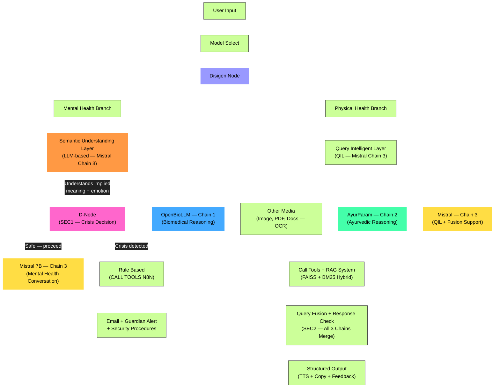

# ReassureAI

Hybrid AI healthcare assistant integrating OpenBioLLM (modern biomedicine) and AyurParam (Ayurveda). Mental wellness support (via Mistral) medical report simplification, and Ayurvedic guidance ; in one system.

---

`Following is just a templant, given by claude:`

# ReassureAI ⚕️

> A hybrid AI healthcare assistant bridging modern
> biomedicine with Ayurvedic wisdom.

[badge: license MIT] [badge: python 3.11] [badge: react]

## What is ReassureAI?

One paragraph. Problem + solution + who it's for.

## Core Features

- 🧠 Mental wellness support
- 📋 Medical report simplification
- 🌿 Ayurvedic guidance (AyurParam)
- 🛡️ Dual-stage safety screening
- 🔍 RAG-enhanced accuracy (FAISS + BM25)

## System Architecture

---

## Architecture Node Explanations

| Node                                  | Model / Tech             | Role                                                                 |
| ------------------------------------- | ------------------------ | -------------------------------------------------------------------- |
| **User Input**                        | React frontend           | Raw query, file upload                                               |
| **Model Select**                      | UI dropdown              | Mental Health / Physical Health / Report                             |
| **Disigen Node**                      | FastAPI dispatcher       | Routes to correct branch                                             |
| **Semantic Understanding Layer**      | Mistral-7B (Chain 3)     | LLM understands true intent, emotion, implied meaning — NOT keywords |
| **D-Node (SEC1)**                     | Decision logic           | Receives semantic analysis → crisis/safe binary decision             |
| **Mistral (Chain 3) — Mental Health** | Mistral-7B Ollama        | Empathetic mental health conversation                                |
| **Rule Based + n8n**                  | n8n workflow             | Guardian alert email on crisis                                       |
| **QIL**                               | Mistral-7B (Chain 3)     | Intent, urgency, domain scores, query reformulation                  |
| **Chain 1 — OpenBioLLM**              | OpenBioLLM-70B HF        | Biomedical clinical reasoning                                        |
| **Chain 2 — AyurParam**               | Aayupahar 3B Ollama      | Ayurvedic reasoning (requires RAG context)                           |
| **Chain 3 — Mistral**                 | Mistral-7B Ollama        | QIL, fusion synthesis, general support                               |
| **Other Media**                       | OCR (pytesseract)        | PDF, image, handwritten docs → text                                  |
| **Call Tools + RAG**                  | FAISS + BM25 + LangChain | Hybrid retrieval, tool calls                                         |
| **SEC2 — Query Fusion**               | Mistral synthesis        | Merges all chains, post-safety, disclaimer                           |
| **Output**                            | React frontend           | TTS, copy, feedback (like/dislike), regenerate                       |

## Tech Stack

| Layer          | Technology       |
| -------------- | ---------------- |
| Frontend       | React.js         |
| Backend        | Python / FastAPI |
| Biomedical LLM | OpenBioLLM-70B   |
| Ayurvedic LLM  | AyurParam        |
| General LLM    | Mistral          |
| Vector Store   | FAISS            |
| Database       | MongoDB          |
| Automation     | n8n              |

## Getting Started

[setup instructions when ready]

## Team

- Aarya R. Thakar (Lead)
- Ansh B. Patel
- Darshan B. Kyada
- Elvis T. Fernandes

## License

MIT © 2025 Aarya R. Thakar
