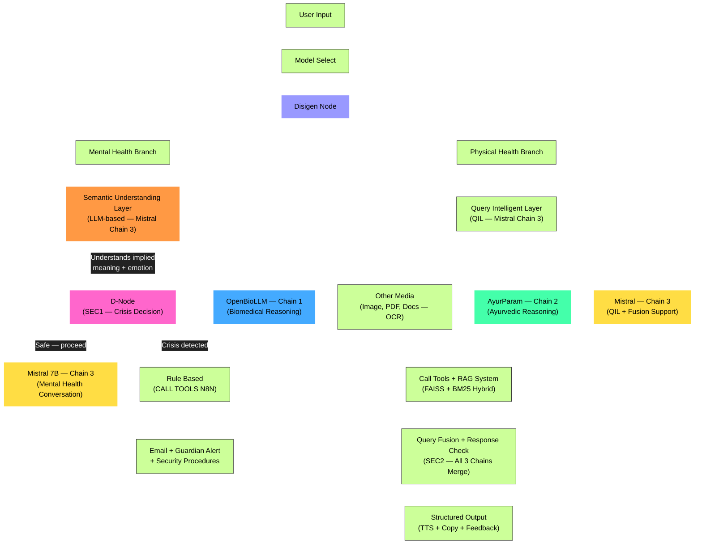

<!--# ReassureAI

Hybrid AI healthcare assistant integrating OpenBioLLM (modern biomedicine) and AyurParam (Ayurveda). Mental wellness support (via Mistral) medical report simplification, and Ayurvedic guidance ; in one system.
-->

<div align="center">


# ⚕️ReassureAI

### A Hybrid AI Healthcare Support System

_Bridging Modern Biomedicine with Ancient Ayurvedic Wisdom_

[](LICENSE)
[](https://python.org)
[](https://reactjs.org)
[](https://fastapi.tiangolo.com)
[]()

> ReassureAI provides mental wellness support, medical report simplification,
> and Ayurvedic health guidance through an intelligent tri-model AI pipeline.
> Built for the Indian context. Not a medical diagnosis tool.
> A hybrid AI healthcare assistant bridging modern
> biomedicine with Ayurvedic wisdom.

</div>

---

## 📋 Table of Contents

- [What is ReassureAI](#-what-is-reassureai)
- [Core Features](#-core-features)
- [System Architecture](#️-system-architecture)
- [Tech Stack](#️-tech-stack)
- [Models on HuggingFace](#-models-on-huggingface)
- [Getting Started](#-getting-started)
- [Demo Login](#-demo-login)
- [Project Structure](#-project-structure)
- [Team](#-team)
- [Disclaimer](#️-disclaimer)
- [License](#-license)

---

## 🧠 What is ReassureAI?

India has **150 million+** people who need mental healthcare — over **80% go untreated**.
Patients receive medical reports in clinical English they cannot understand.
Ayurvedic knowledge, practiced by millions daily, has no intelligent digital interface.

ReassureAI addresses all three gaps in one unified system:

| Problem                                   | ReassureAI Solution                                       |
| ----------------------------------------- | --------------------------------------------------------- |
| Mental health support inaccessible        | 24/7 empathetic AI conversation with crisis detection     |
| Medical reports unreadable by patients    | Plain-language simplification via biomedical LLM          |
| Ayurveda disconnected from digital health | AyurParam model provides Dosha-based traditional guidance |

---

## ✨ Core Features

## Core Features

### 🧠 Mental Wellness Support

- Empathetic conversational support available 24/7
- **Semantic crisis detection** — understands implied distress, not just keywords
- Automatic guardian alert via email when crisis detected
- CBT-aligned response patterns

### 📋 Medical Report Simplification

- Upload blood reports, radiology summaries, discharge notes
- Converted to plain language anyone can understand
- Supports PDF, PNG, JPG, JPEG including handwritten documents
- SHA-256 deduplication — same report never processed twice

### 🌿 Ayurvedic Guidance

- Traditional Dosha-based wellness recommendations
- Integrates with modern medical perspective
- Powered by AyurParam — purpose-built Ayurvedic LLM
- RAG-enhanced to reduce hallucination

### 🤖 Modern Chatbot UX

- Markdown rendered responses
- Text-to-speech on every response
- Copy, regenerate, like/dislike feedback per message
- Auto-scroll with timestamp on every message
- Multiline input (Shift+Enter for new line)

### 🛡️ Dual-stage safety screening

- SEC1 — Pre-inference semantic crisis detection via LLM (not keywords)
- SEC2 — Post-inference contradiction check, herb-drug conflict detection
- Medical disclaimer injected in every response
- Guardian alert system for high-risk situations

### 🔍 RAG-enhanced accuracy

- Hybrid retrieval — FAISS (semantic) + BM25 (keyword) combined
- Reciprocal Rank Fusion for better result ranking
- Reduces LLM hallucination by grounding responses in trusted sources
- Separate knowledge bases for biomedical and Ayurvedic domains

---

## 🏗️ System Architecture



```
User Input
    ↓
Disigen Node (dispatcher)
    ├── Mental Health Branch
    │     ↓
    │   Semantic Understanding Layer (Mistral-7B — LLM, not keywords)
    │     ↓
    │   D-Node SEC1 — Crisis Decision
    │     ├── Crisis → n8n → Guardian Alert Email
    │     └── Safe  → Mistral-7B Conversation
    │
    └── Physical Health Branch
          ↓
        Query Intelligence Layer (QIL)
          ↓
        ┌─────────────────────────────────┐
        │ Chain 1: OpenBioLLM-8B          │
        │ Chain 2: AyurParam (Ayurvedic)  │  ← All 3 run concurrently
        │ Chain 3: Mistral-7B (General)   │
        └─────────────────────────────────┘
          ↓
        RAG — FAISS + BM25 Hybrid Retrieval
          ↓
        SEC2 Query Fusion + Post-Safety Review
          ↓
        Structured Dual-Perspective Response
```

**Two Security Checkpoints:**

- **SEC1 (Pre-inference):** LLM semantic analysis before any response model runs
- **SEC2 (Post-inference):** Contradiction check, herb-drug conflicts, disclaimer injection

### System Architecture Node Explanations

| Node                                  | Model / Tech             | Role                                                                 |
| ------------------------------------- | ------------------------ | -------------------------------------------------------------------- |
| **User Input**                        | React frontend           | Raw query, file upload                                               |
| **Model Select**                      | UI dropdown              | Mental Health / Physical Health / Report                             |
| **Disigen Node**                      | FastAPI dispatcher       | Routes to correct branch                                             |
| **Semantic Understanding Layer**      | Mistral-7B (Chain 3)     | LLM understands true intent, emotion, implied meaning — NOT keywords |
| **D-Node (SEC1)**                     | Decision logic           | Receives semantic analysis → crisis/safe binary decision             |
| **Mistral (Chain 3) — Mental Health** | Mistral-7B Ollama        | Empathetic mental health conversation                                |
| **Rule Based + n8n**                  | n8n workflow             | Guardian alert email on crisis                                       |
| **QIL**                               | Mistral-7B (Chain 3)     | Intent, urgency, domain scores, query reformulation                  |
| **Chain 1 — OpenBioLLM**              | OpenBioLLM-8B HF         | Biomedical clinical reasoning                                        |
| **Chain 2 — AyurParam**               | Aayupahar 3B Ollama      | Ayurvedic reasoning (requires RAG context)                           |
| **Chain 3 — Mistral**                 | Mistral-7B Ollama        | QIL, fusion synthesis, general support                               |
| **Other Media**                       | OCR (pytesseract)        | PDF, image, handwritten docs → text                                  |
| **Call Tools + RAG**                  | FAISS + BM25 + LangChain | Hybrid retrieval, tool calls                                         |
| **SEC2 — Query Fusion**               | Mistral synthesis        | Merges all chains, post-safety, disclaimer                           |
| **Output**                            | React frontend           | TTS, copy, feedback (like/dislike), regenerate                       |

---

## 🛠️ Tech Stack

### Frontend

| Technology                  | Purpose                         |
| --------------------------- | ------------------------------- |
| React 18 + Vite             | UI framework                    |
| Tailwind CSS                | Styling                         |
| Framer Motion               | Animations                      |
| react-markdown + remark-gfm | Markdown rendering              |
| Web Speech API              | Text-to-speech (browser native) |

### Backend

| Technology   | Purpose              |
| ------------ | -------------------- |
| FastAPI      | REST API (async)     |
| Python 3.11+ | Runtime              |
| Motor        | Async MongoDB driver |
| python-jose  | JWT authentication   |
| httpx        | Async HTTP client    |

<!--### AI Models

| Chain    | Model                    | Role                                      |
| -------- | ------------------------ | ----------------------------------------- |
| Chain 1  | OpenBioLLM-8B            | Biomedical clinical reasoning             |
| Chain 2  | AyurParam (Aayupahar 3B) | Ayurvedic traditional reasoning           |
| Chain 3  | Mistral-7B               | QIL, semantic gate, fusion, mental health |
| Embedder | BAAI/bge-m3              | RAG document embedding (1024-dim)         |
-->

### AI Models

| Chain    | Model                                                              | Role                                      |
| -------- | ------------------------------------------------------------------ | ----------------------------------------- |
| Chain 1  | [OpenBioLLM-8B](https://huggingface.co/aaditya/Llama3-OpenBioLLM-8B) | Biomedical clinical reasoning             |
| Chain 2  | [AyurParam GGUF 3B](https://huggingface.co/A-Aryam/AyurParam-GGUF) | Ayurvedic reasoning                       |
| Chain 3  | Mistral-7B                                                         | QIL, semantic gate, fusion, mental health |
| Embedder | BAAI/bge-m3                                                        | RAG document embedding (1024-dim)         |

### Infrastructure

| Technology       | Purpose                            |
| ---------------- | ---------------------------------- |
| MongoDB          | Primary database                   |
| Qdrant Cloud     | Vector database (RAG)              |
| FAISS            | Local vector search fallback       |
| Local disk       | File upload storage                |
| n8n              | Guardian alert workflow automation |
| Ollama           | Local LLM inference                |
| Docker           | As Running Env                     |

<!-- ###
| Layer          | Technology       |
| -------------- | ---------------- |
| Frontend       | React.js         |
| Backend        | Python / FastAPI |
| Biomedical LLM | OpenBioLLM-8B    |
| Ayurvedic LLM  | AyurParam        |
| General LLM    | Mistral          |
| Vector Store   | FAISS            |
| Database       | MongoDB          |
| Automation     | n8n              |
-->

---

## 🤗 Models on HuggingFace

| Model                                                           | Description                                                                             | Downloads                                                                                                                                                       |
| --------------------------------------------------------------- | --------------------------------------------------------------------------------------- | --------------------------------------------------------------------------------------------------------------------------------------------------------------- |
| [AyurParam-GGUF](https://huggingface.co/A-Aryam/AyurParam-GGUF) | GGUF conversions (F16 + Q4_K_M) of bharatgenai/AyurParam for local inference via Ollama |  |

---

## 🚀 Getting Started

### Prerequisites

- Python 3.11+
- Node.js 18+
- MongoDB (running locally)
- Ollama (with `mistral` and `aayupahar` models pulled)
- WSL2 Ubuntu (if on Windows) — see `.agent/codebase/wsl_setup.md`

### Installation

```bash
# Clone the repository
git clone https://github.com/Aaryam-7d6/ReassureAI.git
cd ReassureAI

# Install all dependencies
make install

# Set up environment variables
cp backend/.env.example backend/.env
# Edit backend/.env with your values (see below)

# Seed the test user
make seed

# Start frontend and backend together
make dev
```

### Environment Variables

Visit `.env copy` once.

Create `backend/.env` with these values:

```bash
# Required — fill these now
MONGODB_URI=mongodb://127.0.0.1:27017/reassureai
JWT_SECRET=your_32_char_secret_here
OLLAMA_BASE_URL=http://127.0.0.1:11434
FRONTEND_URL=http://localhost:5173

# Fill when needed
HUGGINGFACE_API_KEY=
GROQ_API_KEY=
QDRANT_URL=
QDRANT_API_KEY=
N8N_WEBHOOK_URL=
UPLOAD_DIR=data/uploads
MAX_UPLOAD_SIZE_BYTES=10485760
```

Generate JWT secret:

```bash
python3 -c "import secrets; print(secrets.token_hex(64))"
```

or

```bash
openssl rand -hex 64
```

Pull required Ollama models:

```bash
ollama pull mistral
ollama run hf.co/A-Aryam/AyurParam-GGUF:Q4_K_M
```

<!-- ollama pull aayupahar -->

Updating soon...

---

## 🧪 Demo Login

A test user is pre-seeded for demonstration and development:

```

Email:    test@reassureai.dev
Password: Test@1234!
Full Name: Test User
Guardian Email: guardian@reassureai.dev

```

> This account is for testing only. Do not use for real health queries.

---

## 📁 Project Structure

Updating soon...

<!--

```
ReassureAI/
├── .agent/                    # AI agent memory system
│   ├── project.md             # System overview and architecture
│   ├── instructions.md        # Coding standards and rules
│   ├── work.md                # Task queue
│   ├── progress.md            # Build progress tracker
│   ├── decisions.md           # Architectural decision log
│   ├── errors.md              # Bug history and lessons
│   └── codebase/              # Per-module documentation
│       ├── backend.md
│       ├── frontend.md
│       ├── models.md
│       ├── database.md
│       ├── api.md
│       ├── wsl_setup.md
│       └── why.md
│
├── backend/                   # FastAPI Python backend
│   ├── main.py
│   ├── config.py
│   ├── requirements.txt
│   └── app/
│       ├── api/               # REST endpoints
│       ├── core/              # Pipeline, safety, models, RAG
│       ├── db/                # MongoDB models
│       ├── schemas/           # Pydantic models
│       └── utils/
│
├── frontend/                  # React + Vite frontend
│   └── src/
│       ├── pages/
│       ├── components/
│       ├── hooks/
│       ├── api/
│       └── utils/
│
├── Makefile                   # Dev commands
├── package.json               # Root concurrently config
└── README.md
```

-->

---

## 👥 Team

<!-- Project Lead, Architecture, AI Pipeline -->

| Name                   | Role                                                                     |
| ---------------------- | ------------------------------------------------------------------------ |
| **Aarya R. Thakar**    | Originator & Project Lead · System Architecture · AI Pipeline · Research |
| **Ansh B. Patel**      | Frontend & Backend Development                                           |
| **Darshan B. Kyada**   | Frontend & Backend Development                                           |
| **Elvis T. Fernandes** | Database                                                                 |

<!--**Project Guide:** Prof. Harsh Pateliya -->

**Institution:** Department of Computer Science & Engineering, PIET, Parul University, Vadodara

_Final Year B.Tech Project — Academic Year 2025–27_

---

## 🔬 Research

Research Paper is progress...

---

## ⚠️ Disclaimer

<!-- ReassureAI is an **educational and informational tool only**.

- It does **not** provide medical diagnosis
- It does **not** replace licensed healthcare professionals
- It does **not** prescribe treatments or medications
- All responses should be verified with a qualified doctor

If you are experiencing a mental health crisis, please contact:

- **iCall:** 9152987821 (Mon–Sat, 8am–10pm)
- **Vandrevala Foundation:** 1860-2662-345 (24/7)
- **MANAS:** 14416 or 1-800-891-4416
-->

> [!WARNING]
> ReassureAI is a student research project developed as a Final Year B.Tech 
> project at Parul University. It is experimental and **not** medically approved, 
> certified, or compliant with HIPAA, DPDP, or any healthcare regulatory framework.

**This tool is for educational and informational purposes only.**

- Does not provide medical diagnosis
- Does not replace licensed healthcare professionals  
- Does not prescribe treatments or medications
- AI responses may be incorrect, incomplete, or outdated
- Not validated by any government body or medical institution
- All responses should be verified with a qualified doctor

> Use at your own risk and with full awareness of its limitations.
> This project explores how AI *can* be applied to healthcare — 
> it is a proof of concept, not a clinical tool.

---

**If you are experiencing a mental health crisis, please contact:**

| Helpline | Number | Available |
|---|---|---|
| iCall | 9152987821 | Mon–Sat, 8am–10pm |
| Vandrevala Foundation | 1860-2662-345 | 24/7 |
| MANAS | 14416 or 1800-891-4416 | 24/7 |

---

<!-- © 2025 Aarya R. Thakar, Ansh B. Patel, Darshan B. Kyada, Elvis T. Fernandes -->

## 📄 License

Licensed under the **Apache License 2.0** — see [LICENSE](LICENSE) for full terms.

© 2025 Aarya R. Thakar, Ansh B. Patel, Darshan B. Kyada, Elvis T. Fernandes

This license is consistent with [AyurParam](https://huggingface.co/bharatgenai/AyurParam)
(bharatgenai/AyurParam) which this project integrates, also licensed under Apache 2.0.

---

<div align="center">


_Built with ❤️ for 150 million Indians who deserve better healthcare access_

</div>
